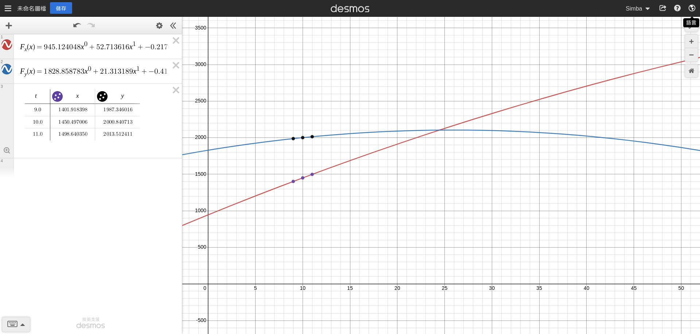
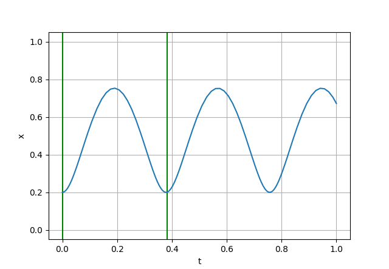

# Problem Set 5.1 13

file: `1.py`

result: 
```
F_x(x) = 945.124048x^0 + 52.713616x^1 + -0.217632x^2 + -0.000000x^3
F_y(x) = 1828.858783x^0 + 21.313189x^1 + -0.411500x^2 + -0.000000x^3
dF_x/dt(x) = 52.713616x^0 + -0.435264x^1 + -0.000000x^2
dF_y/dt(x) = 21.313189x^0 + -0.822999x^1 + -0.000000x^2
t       x               y
9.0,    1401.918398,    1987.346016
10.0,   1450.497006,    2000.840713
11.0,   1498.640350,    2013.512411
v(10) = 50.099442, climb angle = 15.137988°
```



# Problem Set 6.1 13.

file: `2.py`
result: 
```
v0 = 2.4976748324943903, n = 32
```

# Problem Set 7.2 16. 

file: `3.py`

result: 
```
period is 0.382267s
```


