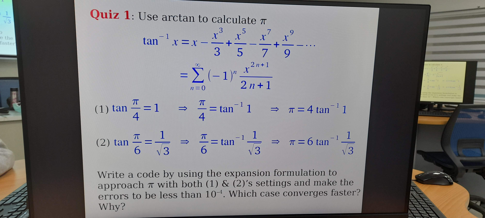
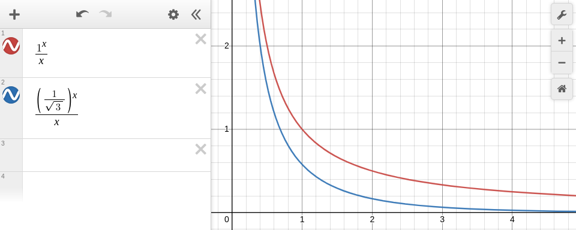

# Execute Result
```
pi = 0.785319645811445 , n = 3184 , error = 0.7500249929238642
pi = 0.5235514642438139 , n = 6 , error = 0.8333483930051946
```

# Questions
## Which converges faster?
The second, ${\pi \over 6} = \tan^{-1}{1 \over \sqrt{3}}$

## Why?
Because ${1 \over \sqrt{3}} < 1$, for all integer $n > 0$ , ${{1 \over \sqrt{3}}^n \over n}$ converge faster than $1^n \over n$


