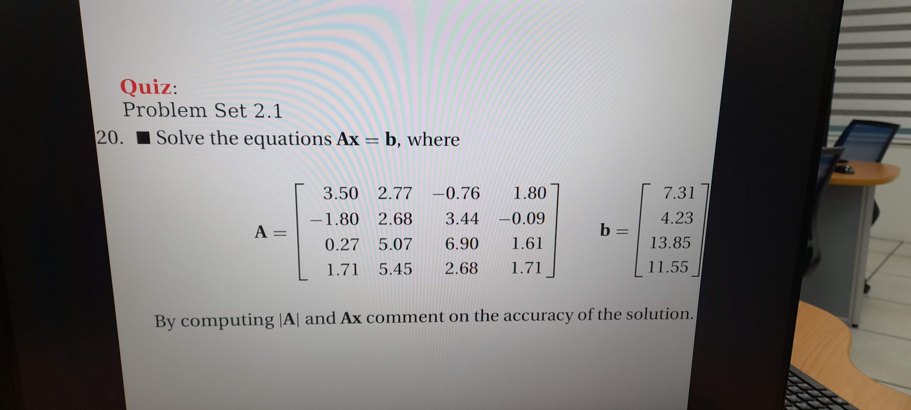
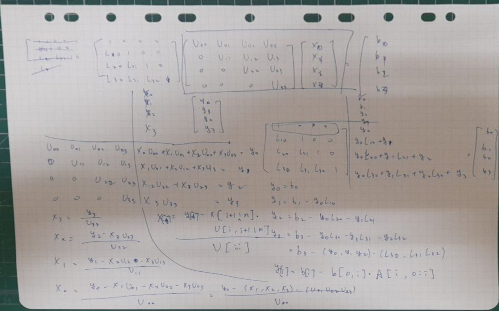

```
x is [-2.31103973  0.32658729 -0.02315412  8.0608364 ]
|A| is 9.751927560000011 ||A|| is 12.829220553096746
The result of x is [-2.31103973  0.32658729 -0.02315412  8.0608364 ]
Ax is [ 7.31  4.23 13.85 11.55]
The error between Ax and b is [1.21501836e-16 0.00000000e+00 0.00000000e+00 1.53797129e-16]
```

Because |A| isn't much small than ||A||, the result should be accurate. 
