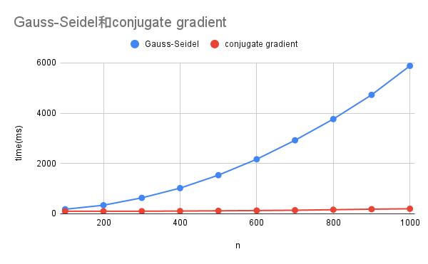

# 數值分析 Quiz 3

C24106082 陳宏彰

## 17. Gauss-Seidel

輸出：

```
n(20):
result: [-7.73502692e+00 -2.07259422e+00 -5.55349941e-01 -1.48805549e-01
 -3.98722562e-02 -1.06834754e-02 -2.86164519e-03 -7.63105388e-04
 -1.90776351e-04 -5.31736131e-12  1.90776340e-04  7.63105380e-04
  2.86164517e-03  1.06834753e-02  3.98722562e-02  1.48805549e-01
  5.55349941e-01  2.07259421e+00  7.73502692e+00  2.88675135e+01] 21 1.0971979078934255
difference: [-4.36020997e-10 -4.34338787e-10 -3.30445893e-10 -1.93611904e-10
 -9.26321242e-11 -3.85449450e-11 -1.65153603e-11 -1.01933349e-11
 -9.58856811e-12 -1.03059017e-11 -1.57903706e-11  6.21950972e-12
 -1.04503784e-11 -9.39417988e-12 -8.63850658e-12 -8.46800408e-12
 -8.45057357e-12 -8.45545856e-12  4.84519092e-11 -1.55182533e-11]
average diff:  7.344718557402047e-10
```

## 18. conjugate gradient

輸出：

```
n(20): 20
result: [-7.73502692e+00 -2.07259421e+00 -5.55349941e-01 -1.48805549e-01
 -3.98722562e-02 -1.06834753e-02 -2.86164518e-03 -7.63105381e-04
 -1.90776345e-04  1.69406589e-20  1.90776345e-04  7.63105381e-04
  2.86164518e-03  1.06834753e-02  3.98722562e-02  1.48805549e-01
  5.55349941e-01  2.07259421e+00  7.73502692e+00  2.88675135e+01] 9
difference: [ 0.00000000e+00  0.00000000e+00  8.88178420e-16 -1.11022302e-16
 -2.77555756e-17  6.93889390e-18  3.46944695e-18 -4.77048956e-18
  4.22838847e-18  1.76182853e-19 -4.44522891e-18  3.46944695e-18
 -3.46944695e-18  0.00000000e+00  2.77555756e-17  0.00000000e+00
  0.00000000e+00 -1.77635684e-15  3.55271368e-15  0.00000000e+00]
average diff:  4.0718657139714276e-15
```

## 速度差異

brenchmark tool: [hyperfine](https://github.com/sharkdp/hyperfine)

|  n   | Gauss-Seidel(ms) | conjugate gradient(ms) |
| :--: | :--------------- | :--------------------- |
| 100  | 179.8±8.7        | 100.9±14.8             |
| 200  | 340.4±7.3        | 100.8±6.2              |
| 300  | 633.2±13.9       | 103.0±5.7              |
| 400  | 1020.0±14.9      | 109.0±6.6              |
| 500  | 1535.7±28.9      | 118.5±5.4              |
| 600  | 2168.0±39.8      | 129.6±6.4              |
| 700  | 2920.8±52.0      | 141.7±6.7              |
| 800  | 3763.8±68.2      | 162.0±12.2             |
| 900  | 4726.6±97.5      | 183.9±22.7             |
| 1000 | 5879.5±73.4      | 199.7±13.4             |


