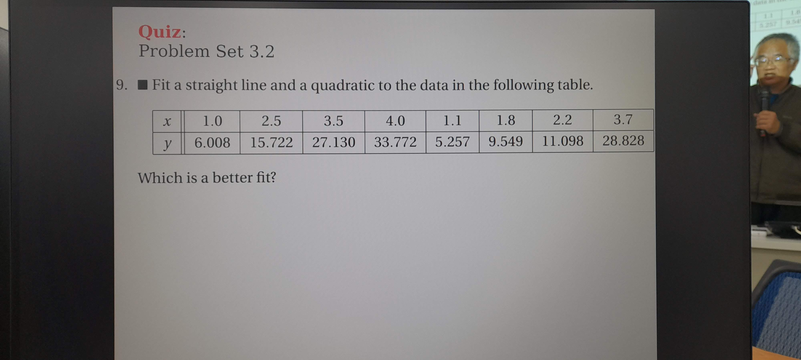

# 數值分析 Quiz 4
C24106082 陳宏彰



```
n = 1
f(x) = -6.1898952506596x^0 + 9.43854353562004x^1
stdDev:  2.2435638279603114
        ╭───────┬───────┬───────────────────────╮
        │x      │y      │f(x)                   │
        │1.0    │6.008  │3.2486482849604403     │
        │2.5    │15.722 │17.4064635883905       │
        │3.5    │27.13  │26.84500712401054      │
        │4.0    │33.772 │31.56427889182056      │
        │1.1    │5.257  │4.192502638522445      │
        │1.8    │9.549  │10.799483113456471     │
        │2.2    │11.098 │14.57490052770449      │
        │3.7    │28.828 │28.732715831134552     │
        ╰───────┴───────┴───────────────────────╯
n = 2
f(x) = 4.405673769460787x^0 + -1.0688961309256586x^1 + 2.1081182154008506x^2
stdDev:  0.8129279610540697
        ╭───────┬───────┬───────────────────────╮
        │x      │y      │f(x)                   │
        │1.0    │6.008  │5.444895853935979      │
        │2.5    │15.722 │14.909172288401958     │
        │3.5    │27.13  │26.488985449881405     │
        │4.0    │33.772 │33.85998069217176      │
        │1.1    │5.257  │5.7807110660775916     │
        │1.8    │9.549  │9.311963751693359      │
        │2.2    │11.098 │12.257394443964458     │
        │3.7    │28.828 │29.3108964538735       │
        ╰───────┴───────┴───────────────────────╯
n = 2 is better with stdDev = 0.8129279610540697 ,
which is f(x) = 4.405673769460787x^0 + -1.0688961309256586x^1 + 2.1081182154008506x^2
```
